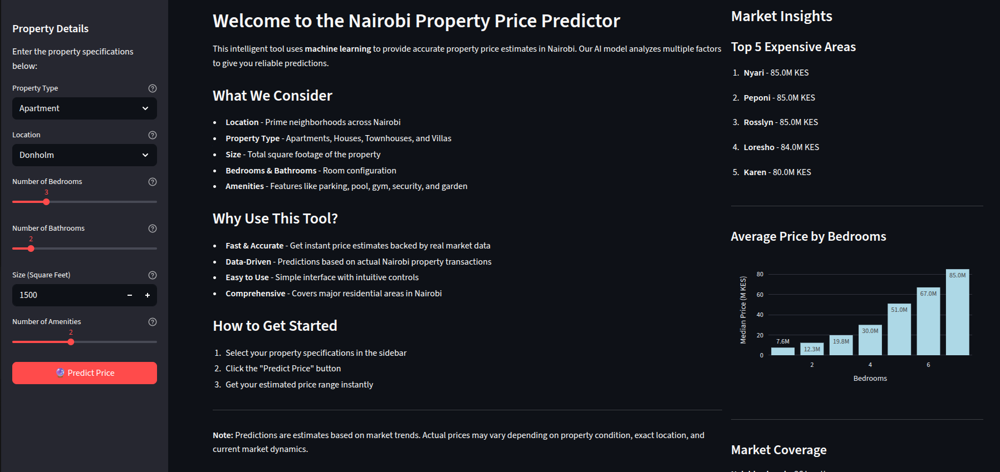
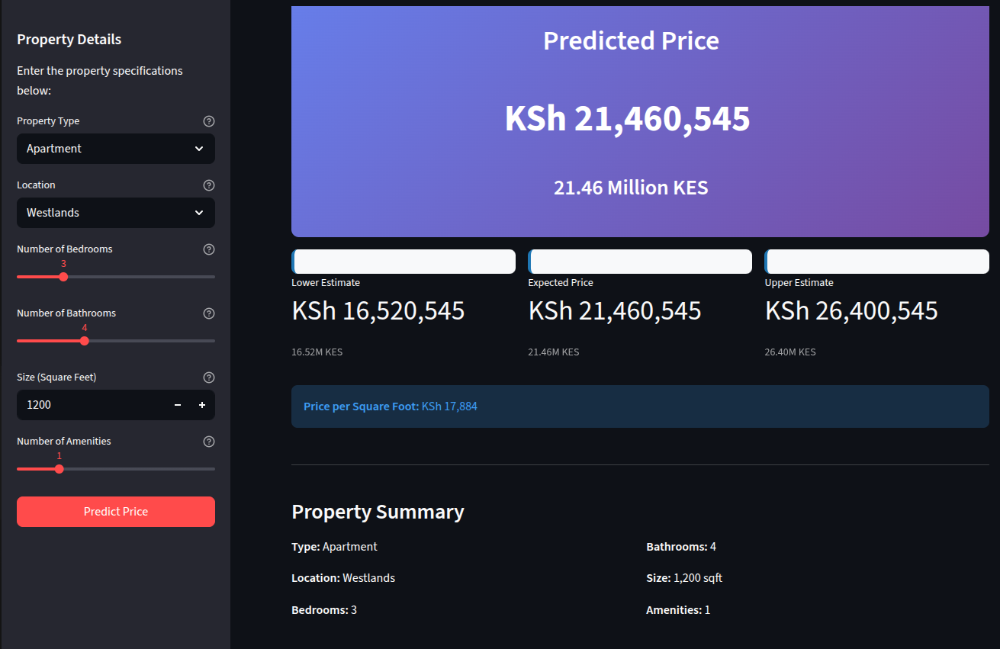
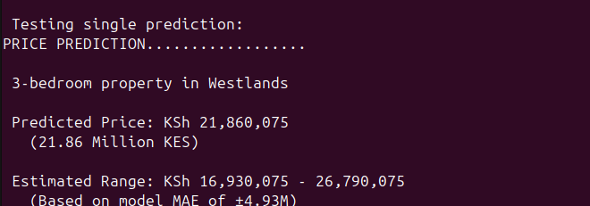

# Nairobi House Price Prediction


A complete machine learning pipeline for predicting residential property prices in Nairobi, Kenya. From web scraping to trained models, this project demonstrates end-to-end data science workflow for real estate price prediction.

---

##  Project Overview

This project predicts house prices in Nairobi based on property features like location, size, bedrooms, and amenities. The system includes:

- **Web scraper** for collecting property listings from Property24.co.ke
- **Data cleaning pipeline** removing outliers and standardizing formats
- **Machine Learning models** (Linear Regression & Random Forest)
- **Interactive Streamlit app** for real-time price predictions
- **Prediction scripts** for estimating new property prices
- **Visualization suite** for exploratory data analysis

### Key Results
- **clean property listings** collected and processed
- **Random Forest model** achieving R² = 0.801 (80.1% variance explained)
- **Mean Absolute Error** of ±4.93 Million KES
- **Production-ready** web application and modular code

---

##  Problem Statement

Real estate pricing in Nairobi is opaque and inconsistent. Buyers, sellers, and agents lack data-driven tools to make informed decisions. This project addresses that gap by building a predictive model trained on real market data.

**Solution:** A machine learning model trained on 651 high-quality listings to predict prices within ±5M KES on average, helping stakeholders make evidence-based decisions.

---

##  Project Structure

```
nairobi_property/
├── data/
│   ├── raw_listings.csv          # Original scraped data
│   ├── clean_listings.csv        # Cleaned data 
│   └── data_dictionary.md        # Data documentation
│
├── models/
│   └── model.pkl                 # Trained Random Forest model
│
├── notebooks/
│   ├── day1.ipynb                # Data collection & exploration
│   ├── day2_cleaning.ipynb       # Data cleaning process
│   ├── day2_eda.ipynb            # Exploratory data analysis
│   ├── day3_baseline_model.ipynb # Linear Regression baseline
│   └── day4_model_improvement.ipynb  # Random Forest training
│
├── scripts/
│   ├── clean_data.py             # Data cleaning functions
│   ├── feature_engineering.py    # Feature creation
│   ├── train_model.py            # Model training pipeline
│   ├── visualizations.py         # EDA plotting functions
│   └── predict.py                # Price prediction
│
├── scrapping/
│   ├── convert.py                # Data type conversions
│   ├── read_scrapped_data.py     # HTML parsing
│   ├── property_scraper.py       # Main scraper logic
│   └── run_scrapper.py           # Scraper execution
│
├── app/
│   └── streamlit_app.py          # Interactive web interface
│
├── screenshots/                   # Streamlit app screenshots
│   ├── 1st_page.png              # Home screen
│   └── prediction.png            # Prediction result
│
├── visualizations/               # Generated EDA plots
│   ├── price_by_location.png
│   ├── size_vs_price.png
│   ├── price_by_bedrooms.png
│   ├── price_per_sqft_by_location.png
│   ├── correlation_heatmap.png
│   ├── market_segments.png
│   └── property_types.png
│
├── requirements.txt              # Python dependencies
└── README.md                     # This file
```

---

##  Interactive Web Application

An intuitive Streamlit-powered interface for instant property price predictions:

### Home Screen

*User-friendly interface with property specification form and market insights*

### Price Prediction

*Instant price estimates with confidence intervals and detailed property summary*

### Key Features
-  **Modern UI** - Clean design with gradient styling and intuitive controls
-  **Real-time Predictions** - Get price estimates instantly as you adjust parameters
-  **Market Insights** - View top expensive areas and price trends by bedroom count
-  **Interactive Charts** - Dynamic visualizations powered by Plotly
-  **Price Range** - Confidence intervals based on model performance
-  **Price per Sqft** - Understand cost efficiency of properties

### Run the App
```bash
cd nairobi_property
streamlit run app/streamlit_app.py
```

The app will open in your browser at `http://localhost:8501`

---

##  Quick Start

### Prerequisites
- Python 3.12+
- pip package manager

### Installation

1. **Clone the repository**
```bash
git clone https://github.com/mwandikikepha/Nairobi_Properties.git
cd nairobi_property
```

2. **Install dependencies**
```bash
pip install -r requirements.txt
```

3. **Run predictions** (using pre-trained model)
```bash
cd scripts
python predict.py
```

---

##  Usage Examples

### 1. Make a Price Prediction

```python
from scripts.predict import load_model, prepare_input, predict_price, interpret_prediction

# Load trained model
model = load_model("models/model.pkl")

# Prepare property features
features = prepare_input(
    bedrooms=3,
    bathrooms=2,
    size_sqft=1500,
    location='Westlands',
    property_type='Apartment',
    amenity_score=2
)

# Get prediction
prediction = predict_price(model, features)
interpret_prediction(prediction, 3, 'Westlands', 'Apartment', 1500)
```

**Output:**



```

PRICE PREDICTION

 3-bedroom Apartment in Westlands

 Predicted Price: KSh 21,860,000
   (21.86 Million KES)

 Estimated Range: KSh 16,570,000 - 26,430,000
   (Based on model MAE of ±4.94M)

```

### 2. Clean New Data

```bash
cd scripts
python clean_data.py
```

### 3. Generate Visualizations

```bash
cd scripts
python visualizations.py
```

### 4. Train Model from Scratch

```bash
cd scripts
python train_model.py
```

---

##  Data Pipeline

### 1. Data Collection
**Source:** Nairobi residential listings
**Method:** Custom BeautifulSoup web scraper  
**Raw Data:** listings scraped  
**Features Collected:** Location, property type, bedrooms, bathrooms, size (sqft), amenities, price (KES), listing date

### 2. Data Cleaning
**Cleaning Steps:**
- Removed duplicate listings
- Filtered out size outliers (<200 sqft or >20,000 sqft)
- Removed price outliers (<5M KES or >100M KES)
- Dropped listings with missing amenities
- Standardized location and property type names

**Result:** high-quality listings (74% data retention)

### 3. Feature Engineering
**Created Features:**
- `price_per_sqft`: Price normalized by size for comparison
- `amenity_score`: Count of amenities (0-5)
- `month`: Temporal feature extracted from listing date

### 4. Model Training
**Models Developed:**

| Model | MAE (M KES) | RMSE (M KES) | R² Score |
|-------|-------------|--------------|----------|
| Linear Regression | 7.33 | 11.23 | 0.607 |
| **Random Forest** | **4.93** | **11.14** | **0.801** |

**Winner:** Random Forest  
- 32% better MAE (7.33M → 4.93M KES)
- 26% better R² (0.607 → 0.801)
- Better handling of non-linear relationships

---

##  Technologies Used

**Core Stack:**
- Python 3.12
- Pandas & NumPy (Data manipulation)
- Scikit-learn (Machine learning)
- Matplotlib & Seaborn (Visualization)

**Data Collection:**
- BeautifulSoup4 (HTML parsing)
- Requests (HTTP requests)

**Development:**
- Jupyter Notebooks (Interactive analysis)
- Git (Version control)
- pickle (Model serialization)

---

##  Model Details

### Random Forest Regressor
```python
RandomForestRegressor(
    n_estimators=100,
    max_depth=15,
    min_samples_split=5,
    random_state=42,
    n_jobs=-1
)
```

**Training Configuration:**
- Training Set: 80% 
- Test Set: 20% 
- Features: 6 (bedrooms, bathrooms, size_sqft, location, property_type, amenity_score)
- Target Variable: price_kes

**Performance:**
- MAE: 4.93M KES
- RMSE: 11.14M KES
- R²: 0.801

**Interpretation:** Model predictions are within ±4.93M KES of actual prices on average, explaining 80.1% of price variance.

---

##  Visualizations

The project includes publication-quality visualizations:

1. **Price Distribution by Location** - Boxplots for top 10 neighborhoods
2. **Size vs Price Scatter** - Correlation with trend line and bedroom color coding
3. **Price by Bedrooms** - Median and distribution analysis
4. **Price per Sqft by Location** - Cost efficiency comparison
5. **Correlation Heatmap** - Feature correlation matrix
6. **Market Segments** - Property type distribution
7. **Property Types** - Analysis by category

All visualizations feature:
- Million KES formatting for readability
- Color gradients for visual appeal
- Grid lines for precise reading
- Professional styling and annotations

---


### Planned Improvements
- Expand to much listings from multiple sources
- Add GPS coordinates for better location features
- Implement time-series analysis for market trends
- Build interactive Streamlit web app
- Try XGBoost for potential accuracy gains
- Add property condition and age features

---

##  Use Cases

### For Home Buyers
- Evaluate if a property is fairly priced
- Compare prices across neighborhoods
- Budget effectively for desired locations

### For Sellers
- Set competitive listing prices based on data
- Identify which improvements add the most value
- Avoid overpricing or underpricing

### For Real Estate Agents
- Provide clients with data-driven estimates
- Quickly assess property values
- Identify undervalued investment opportunities

### For Property Developers
- Understand price trends across Nairobi
- Determine optimal property specifications
- Forecast returns on development projects

### For Researchers
- Analyze Nairobi real estate market trends
- Study feature-price relationships
- Generate policy insights

---

##  Contributing

Contributions, suggestions, and feedback are welcome!

---

##  Author

**Kepha Mwandiki**  
Data Engineer

- GitHub: [@mwandikikepha](https://github.com/mwandikikepha)
- Project: [Nairobi Properties](https://github.com/mwandikikepha/Nairobi_Properties)

---

